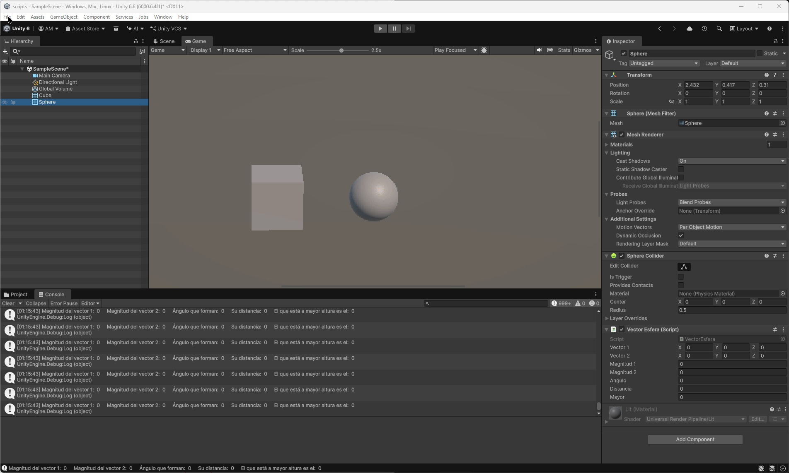

# Ejercicios 1 al 4

### 1. Crea un script asociado a un objeto en la escena que inicialice un vector de 3 posiciones con valores entre 0.0 y 1.0, para tomarlo como un vector de color (Color). Cada 120 frames se debe cambiar el valor de una posición aleatoria y asignar el nuevo color al objeto. Parametrizar la cantidad de frames de espera para poderlo cambiar desde el inspector.
Lo asocié al cubo. Para parametrizar hacía falta que el vector fuera público. Además, el color se modificaba en el Renderer del objeto, en material.color  

### 2. Crea un script asociado a la esfera con dos variables Vector3 públicas. Dale valor a cada componente de los vectores desde el inspector. Muestra en la consola: a. La magnitud de cada uno de ellos. b. El ángulo que forman. c. La distancia entre ambos. d. Un mensaje indicando qué vector está a una altura mayor. Muestra en el inspector cada uno de esos valores.
Los valores se calculaban el Update() para que se actualizaran automáticamente al modificarse los componentes. Para decir que estaban a la misma altura lo codifiqué con un 0.

### 3. Muestra en pantalla el vector con la posición de la esfera.
Lo hice en el método OnGUI() con un GUI.Label() para mostrar el texto en la pantalla.

### 4. Crea un script para la esfera que muestre en consola la distancia a la que están el cubo y el cilindro.
Yo interpreté que el script pertenecía a la esfera y que lo que se calculaba era la distancia entre la esfera y los otros dos (en lugar de que fuera la distancia del cubo con el cilindro). En este era importante crear los Tags y asignarlos, para poder acceder con FindWithTag().

