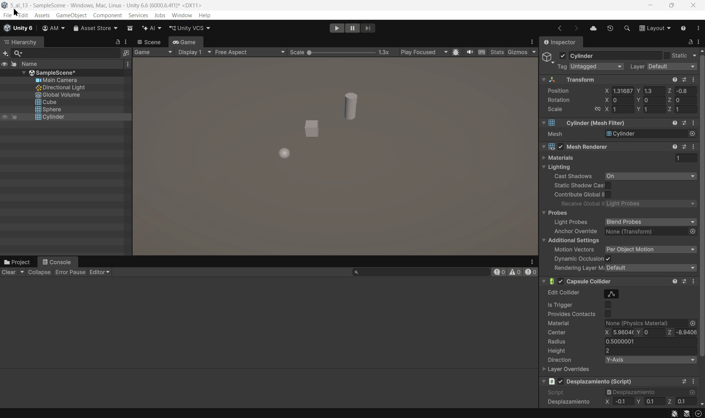
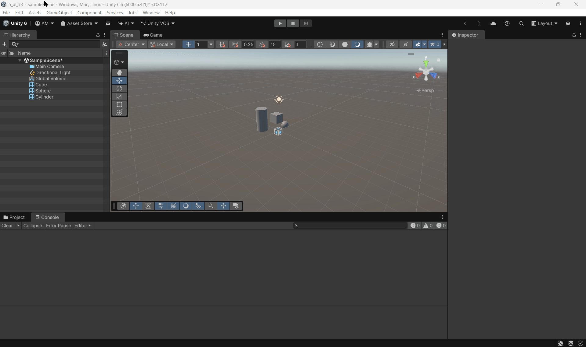
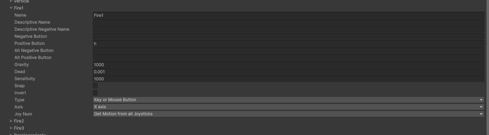
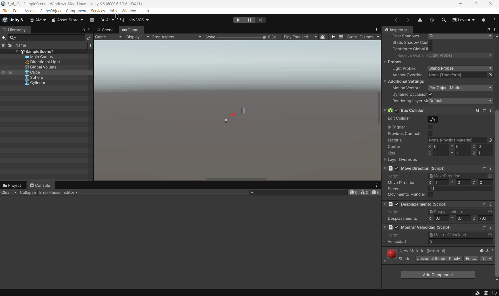
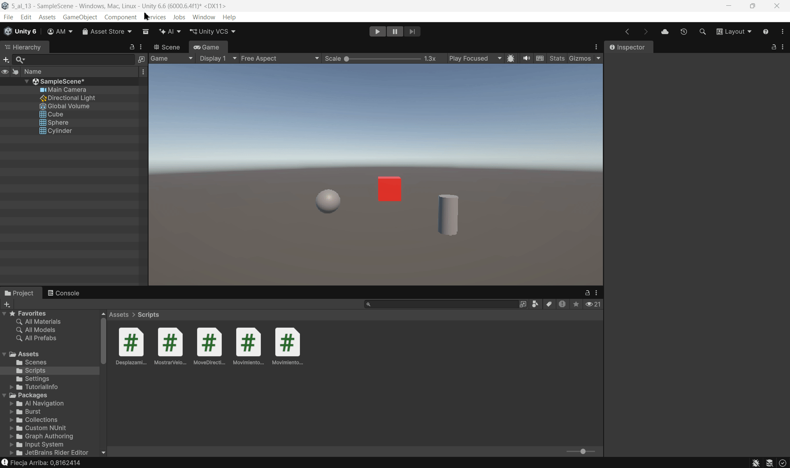
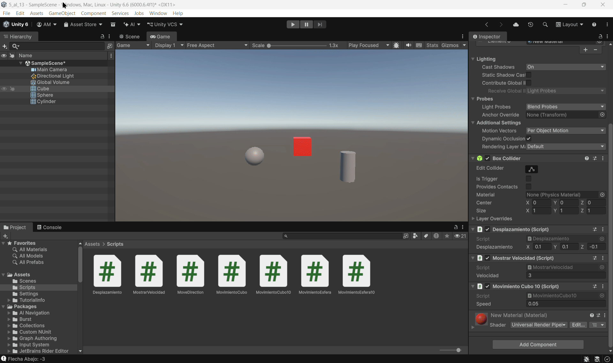
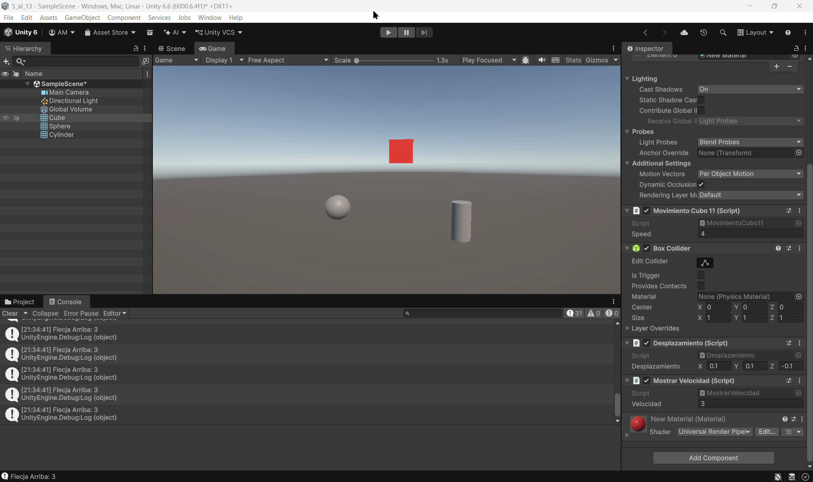
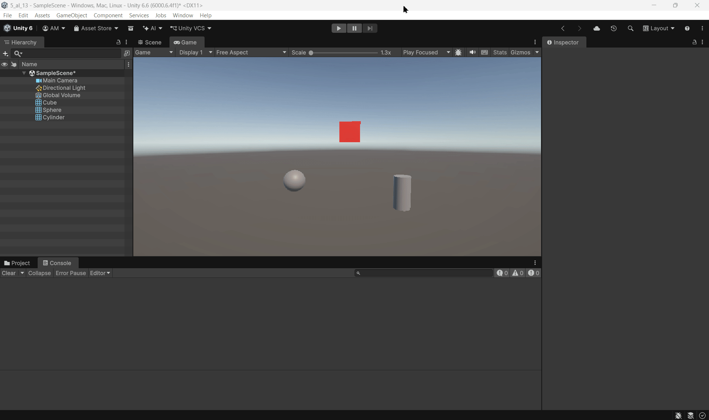
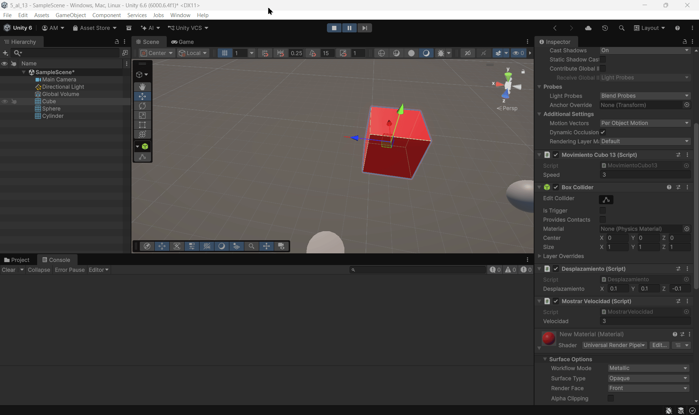

# Ejercicios

### 5. Selecciona tres posiciones en tu escena a través de un objeto invisible (marcador) que incluya 3 vectores numéricos para configurar posiciones en las que quieres ubicar los objetos en respuesta a pulsar la barra espaciadora. Estos vectores representan un desplazamiento respecto a la posición original de cada objeto. Crea un script que ubique en las posiciones configuradas cuando el usuario pulse la barra espaciadora.

### 6. Agrega un campo velocidad a un cubo y asígnale un valor que se pueda cambiar en el inspector de objetos. Muestra la consola el resultado de multiplicar la velocidad por el valor del eje vertical y por el valor del eje horizontal cada vez que se pulsan las teclas flecha arriba-abajo ó flecha izquierda-derecha. El mensaje debe comenzar por el nombre de la flecha pulsada.

### 7. Mapea la tecla H a la función disparo.

### 8. Crea un script asociado al cubo que en cada iteración traslade al cubo una cantidad proporcional un vector que indica la dirección del movimiento: moveDirection que debe poder modificarse en el inspector.  La velocidad a la que se produce el movimiento también se especifica en el inspector, con la propiedad speed. Inicialmente la velocidad debe ser mayor que 1 y el cubo estar en una posición y=0.

**Observaciones:**

- **a)** Cuando dupliqué las coordenadas de la dirección, el desplazamiento fue el doble.
- **b)** Al duplicar la velocidad manteniendo la dirección, el desplazamiento también es doble. Va más rápido.
- **c)** Si la velocidad es menor que 1, manteniendo el resto igual, el movimiento es más lento.
- **d)** Si el cubo parte de una posición con y > 0, empieza a mayor altura y la mantiene si no hay desplazamiento vertical.
- **e)** En el sistema local, cuando giré el cubo 90 grados, observé que se desplazaba hacia el fondo porque seguía sus propios ejes. En el sistema mundial, el movimiento seguía los ejes del mundo independientemente de la rotación del cubo.

### 9. Mueve el cubo con las teclas de flecha arriba-abajo, izquierda-derecha a la velocidad speed. Cada uno de estos ejes implican desplazamientos en el eje vertical y horizontal respectivamente. Mueve la esfera con las teclas w-s (movimiento vertical) a-d (movimiento horizontal).

### 10. Adapta el movimiento en el ejercicio 9 para que sea proporcional al tiempo transcurrido durante la generación del frame.

### 11. Adapta el movimiento en el ejercicio 10 para que el cubo se mueva hacia la posición de la esfera. Debes considerar que el avance no debe estar influenciado por cuánto de lejos o cerca estén los dos objetos.

### 12. Adapta el movimiento en el ejercicio 11 de forma que el cubo avance mirando siempre hacia la esfera, independientemente de la orientación de su sistema de referencia. Para ello, el cubo debe girar de forma que el eje Z positivo apunte hacia la esfera . Realiza pruebas cambiando la posición de la esfera mediante las teclas awsd

### 13. Utilizar el eje “Horizontal” para girar el objetivo y que avance siempre en la dirección hacia adelante.

